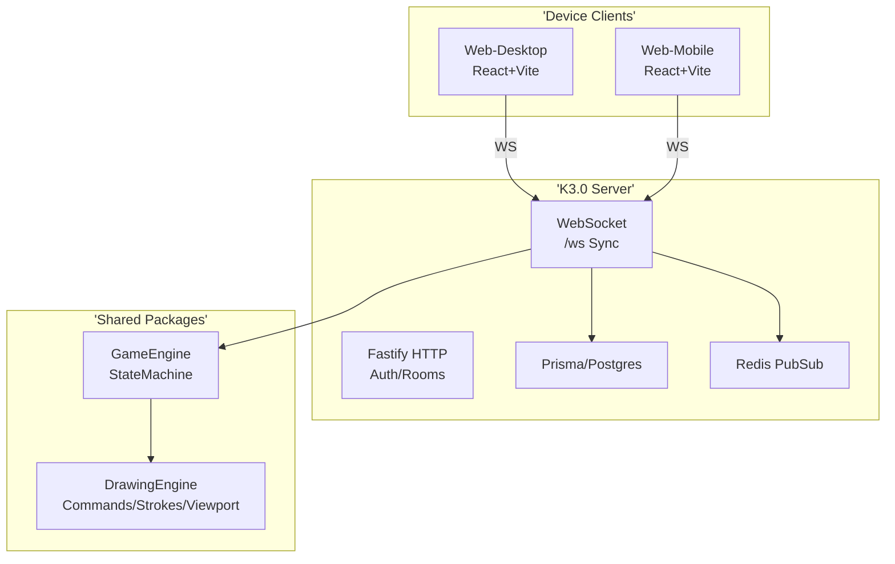
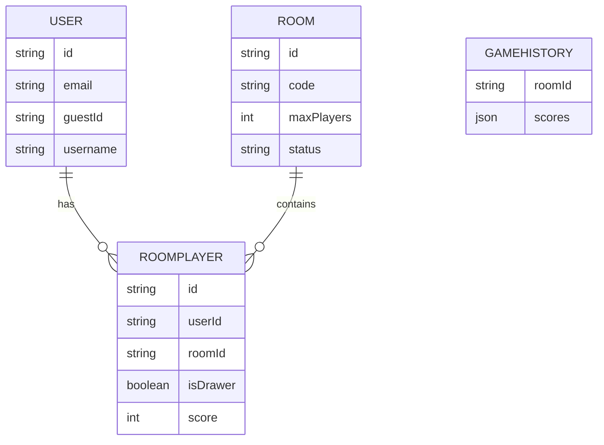

# KRIBBLE - Complete System Documentation

## Table of Contents
1. [Abstract](#abstract)
2. [Introduction](#introduction)
3. [Version History & Evolution](#version-history)
4. [Problem Statement](#problem-statement)
5. [Objectives](#objectives)
6. [Scope](#scope)
7. [Methodology](#methodology)
8. [System Architecture](#architecture)
9. [Database Schema](#database)
10. [Requirements Analysis](#requirements)
11. [Key Components](#components)
12. [Deployment Guide](#deployment)
13. [Feasibility & Analysis](#feasibility)
14. [Getting Started](#getting-started)
15. [Advantages & Disadvantages](#advantages)
16. [Future Scope](#future)
17. [Conclusion](#conclusion)
18. [References](#references)

## Abstract
Kribble is a real-time multiplayer drawing and guessing game that has evolved from a single-device prototype (v0) through a feature-complete v2.0 to the production-stable K3.0 monorepo. This documentation covers the full system evolution, with K3.0 as the current stable version featuring modular engines (DrawingEngine, GameEngine), WebSocket multiplayer, Prisma/Postgres persistence, and device-optimized clients (desktop/mobile). Designed for scalability, it supports guest/Google auth, rooms, command-based canvas sync, and state-machine-driven gameplay.

## Introduction
Kribble began as a Pictionary-style web game addressing real-time collaboration challenges. From v0 (basic canvas) to v2.0 (multiplayer CanvasV2), it reached K3.0: a monorepo refactor extracting shared engines for maintainability and cross-device support.

## Version History & Evolution
| Version | Key Milestones | Tech Stack | Status |
|---------|----------------|------------|--------|
| v0 (Initial) | Basic drawing canvas | HTML5 Canvas/JS | Prototype |
| Kribble2.0 | CanvasV2 (strokes/viewport/sync/undo), multiplayer rooms, Docker/Render | React CRA + CRACO/TS Client, Node Server | Legacy Stable |
| K3.0 | Monorepo, DrawingEngine/GameEngine extraction, Fastify+WS+Prisma/Redis, Vite+React desktop/mobile | TS Workspaces, Tailwind, Docker-Compose | **Current Production Stable** |

**Upgrade Path (K2.0 → K3.0)**:
1. Migrate CanvasV2 logic to packages/drawing-engine.
2. Extract game states to packages/game-engine.
3. Refactor client to Vite monorepo (separate web-desktop/mobile).
4. Add Prisma DB/Redis for persistence.
5. Deploy via docker-compose (vs Render).

## Problem Statement
Early versions lacked: real-time sync (bitmap lag), persistence, cross-device UX, modular engines. Multiplayer drawing requires low-latency commands, authoritative server, state reconciliation.

## Objectives
- Enable seamless multiplayer drawing/guessing.
- Achieve 60fps desktop/30+fps mobile.
- Support upgrade from legacy without data loss.
- Production stability (Docker, heartbeats, reconnects).

## Scope
- Core: Auth, Rooms, Gameplay (Lobby→Drawing→Guessing), Canvas sync.
- Excludes: AI judging, custom brushes (future).

## Methodology
- **Development**: Iterative (v0 prototype → v2.0 MVP → K3.0 refactor). Monorepo with npm workspaces.
- **Tools**: TS strict, ESLint/Prettier, Vite dev/build.
- **Testing**: Manual multiplayer, WS latency checks.
- **Deployment**: Docker-Compose local/prod, Render (v2.0).

## System Architecture


## Database Schema


## Requirements Analysis
**Functional**:
- Auth: Guest temp users, email persistence.
- Rooms: Create/join by code, ready/checks.
- Gameplay: Word select → Draw (strokes) → Guess → Score.
- Canvas: Zoom/pan/layers/undo (command-based).

**Non-Functional**:
- Latency: <100ms WS.
- Perf: 10k strokes replayable.
- Scalability: Rooms up to 8 players.

## Key Components
### DrawingEngine (Evolved from CanvasV2)
- Strokes: Points/color/size.
- Viewport: Zoom/pan/reset.
- Commands: Stack/undo/redo/export.
- Layers: Visibility/opacity.

### GameStateMachine
States: `lobby` → `starting` → `wordSelection` → `drawing` → `guessing` → `roundEnd` → `gameEnd`.
Server-authoritative transitions.

### Server
- WS: Connection mgmt/heartbeats/message routing.
- HTTP: /health, auth/guest, rooms.

### Clients
- Desktop: Full UI (sidebar/rooms list, profile/stats, friends/recent).
- Mobile: Optimized (touch gestures from CanvasV2 heritage).

### Complete Feature Matrix (All Versions → Stable K3.0)
| Feature | v0 | K2.0 | K3.0 Stable | Notes/Progress |
|---------|----|------|-------------|---------------|
| **Auth** | - | Guest (name/avatar) | Guest + email persist | K3.0 adds Prisma User model |
| **Rooms** | - | Public/private/code/cap8 | +DB persist/ready checks | Services → Prisma |
| **Game States** | Basic | LOBBY/CHOOSE/GAME/TURN/RESULT | Full StateMachine (7 states) | Extracted to package |
| **Canvas** | Basic | CanvasV2: strokes/zoom/pan/pressure/touch/fill/erase/clear/undo | DrawingEngine: layers/viewport/commands | 100% ported + enhanced |
| **Drawing Tools** | Pen | Pen/erase/fill/clear | +Layers/opacity/blend | WebWorker flood-fill retained |
| **Sync** | - | Socket.io ops broadcast | WS commands/heartbeats | Deterministic replay |
| **Scoring** | - | Time-based (100-50pts) | +DB history | Cumulative/rounds |
| **Timers** | - | Drawing120s/choose15s/etc | Inherited + server auth | Configurable |
| **UI** | Single | React CRA/Tailwind/contexts | Vite monorepo desktop/mobile | Zustand stores |
| **Deploy** | - | Docker/Render | +docker-compose/Postgres/Redis | PRODUCTION_PLAN |
| **Perf** | - | Throttled | 60fps/10k strokes | Viewport optimized |

**Progress to Stable (from TODOs/BUGFIXES)**:
- CanvasV2 → DrawingEngine: ✅ Complete (pressure/sync/gestures).
- Server bugs (host ready/auth): ✅ Fixed.
- TS/setup: ✅ Resolved (npm install/db:generate).
- K3.0: Production-ready monorepo.

## Deployment Guide

**K2.0 (Render)**: See DEPLOY_TO_RENDER.md (Client+Server Docker).
**K3.0 (Docker-Compose)**:
```
docker-compose up -d  # Postgres+Redis+Server
npm run dev  # Clients
```
Prod: PRODUCTION_PLAN.md.

## Feasibility & Analysis
**Technical**: Proven stack, monorepo scales.
**Economic**: Low-cost (Docker self-host/Render).
**Security**: WS heartbeats/stale removal, Prisma auth.
**Risks**: WS disconnects (handled by snapshots), scale (Redis pubsub).

## Getting Started
See GETTING_STARTED.md (Docker/manual, .env, npm run dev).

## Advantages & Disadvantages
**Advantages**:
- Modular engines (reusable).
- Cross-device native UIs.
- Persistent games/DB replays.

**Disadvantages**:
- Monorepo complexity vs K2.0 simplicity.
- WS dependency (fallbacks needed).

## Future Scope
- Google Auth integration.
- Ranked mode/AI hints.
- Custom words/rooms.
- Mobile PWA/native.

## Conclusion
Kribble has matured from v0 prototype to K3.0 stable platform. Modular design ensures longevity; upgrade paths preserve legacy value.

## References
- K3.0/GETTING_STARTED.md, PRODUCTION_PLAN.md.
- Kribble2.0/KRIBBLE_2.0_ANALYSIS.md.
- Prisma docs, Fastify WS, Canvas API.

